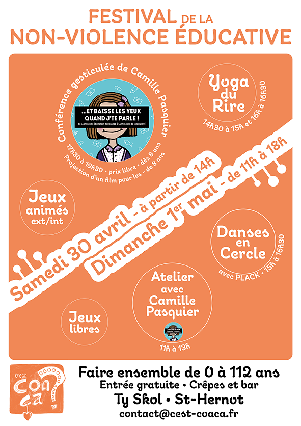

**À venir :**
- **Yoga du Rire - tous les vendredis à 17h30 - Maison Ursule - sur le port du Fret**
- **FNVE #2 : 29 et 30 avril 2023 - Ty Skol CROZON**

*******

### **C'est Coaça ?**, pour un accompagnement des citoyen·nes vers une société libérée de toutes formes de violence. Informer sur les violences éducatives ordinaires, proposer des espaces de partage et d'expérimentation afin de développer des relations sans enjeu de domination et ainsi un apprentissage de la paix.

Pour plus d'informations, contactez-nous par mail : <a href="mailto:contact@cest-coaca.fr">contact@cest-coaca.fr</a>

