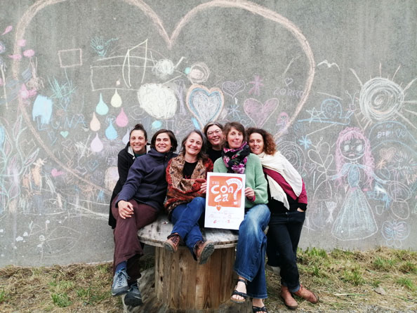
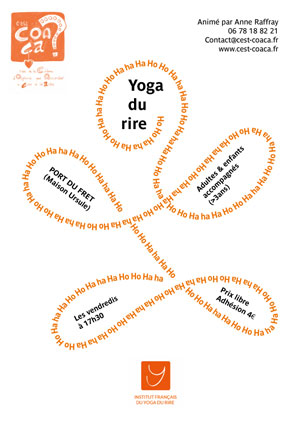

**Actualités**

Nos activités reprennent avec de nouvelles formules pour cette année 2026-2027 !

Les séances de **Yoga du Rire** seront maintenant de 1h30 afin de pouvoir intégrer un temps plus long de relaxation (surprise à découvrir) et une nouvelle séance ouvre à Lanvéoc le vendredi soir (1*/mois)

Les ateliers de **Familles des bois** auront lieu entre les vacances de printemps et les vacances d'automne. A la journée ou au week-end. Plus d'info sur la page dédiée.

Les tarifs des cotisations aux ateliers et de l'adhésion à l'association ont été modifiés.

**Nos rendez-vous**

- Jeudi 10 septembre : Yoga du Rire - **10h30 / 12h00 - Maison Ursule - salle étage1** (Port du Fret - Crozon)
- Vendredi 25/09 : Yoga du Rire - **19h00/20h30 - Maison des associations - salle étage1** (Lanveoc)

    
 
 

 

Objet de l'association : **C'est COAÇA ?**
 
L’association a pour but d’accompagner les citoyens et les citoyennes vers une société libérée de toutes formes de violence, en particulier des violences éducatives ordinaires, de promouvoir la santé physique et psychoaffective de chacun·e. 
Toutes les actions menées par l'association se feront dans une démarche respectueuse du vivant et en conscience de l'impact sur l'environnement. 
Ainsi C’est COACA ? se veut être une association évoluant dans les domaines de l’éducation, de la santé, du bien-être et de l’environnement. 

**Pour adhérer, afin de participer à nos activités ou simplement pour nous soutenir, le montant est fixé à 10€ pour les personnes majeures, 5€ pour les mineures.**
C'est par [ici](https://www.helloasso.com/associations/c-est-coaca-c-est-de-la-culture-d-ocytocine-pour-accorder-le-coeur-et-les-actes/adhesions/adhesion-2026-2027)!
 
 

<!--Le mouvement, les sensations corporelles, l’écoute et le dialogue sont la base de notre travail sur les relations, à soi, aux autres et au monde. 
Nous proposons également des programmes personnalisés, mêlants nos différentes compétences, sur devis.
-->
Pour plus d'informations, contactez-nous par mail : <a href="mailto:contact@cest-coaca.fr">contact@cest-coaca.fr</a> 
Vous pouvez également nous suivre sur notre page [Facebook](https://www.facebook.com/profile.php?id=61566927644585)

<!--

-->
