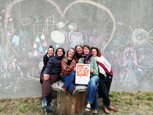

**Nouveauté:** 
**YOGA DU RIRE SPECIAL NOUVELLE ANNEE : DIMANCHE 05 janvier 2025 à 11H à la Maison pour Tous de Tal Ar Groas (Crozon)** 

**Nos rendez-vous sur inscription** 

Jeudi 09/01 - 18h : YOGA DU RIRE 
Vendredi 10/01 - 9h30 : YOGA DU RIRE ASSIS 
Dimanche 19/01 - 14h : FAMILLES DANS LES BOIS 

*******

     
Objet de l'association : **C'est COAÇA ?** 
L’association a pour but d’accompagner les citoyens et les citoyennes vers une société libérée de toutes formes de violence, en particulier des violences éducatives ordinaires, de promouvoir la santé physique et psychoaffective de chacun·e. 
Toutes les actions menées par l'association se feront dans une démarche respectueuse du vivant et en conscience de l'impact sur l'environnement. 
Ainsi C’est COACA ? se veut être une association évoluant dans les domaines de l’éducation, de la santé, du bien-être et de l’environnement. 

Pour adhérer, ou simplement nous soutenir, le montant est fixé à 4€ / personne quelque soit l'âge.  
C'est par [ici](https://www.helloasso.com/associations/c-est-coaca-c-est-de-la-culture-d-ocytocine-pour-accorder-le-coeur-et-les-actes/adhesions/adhesion-2023-2024/widget-bouton) !

*******
<!--Le mouvement, les sensations corporelles, l’écoute et le dialogue sont la base de notre travail sur les relations, à soi, aux autres et au monde. 
Nous proposons également des programmes personnalisés, mêlants nos différentes compétences, sur devis.
-->
Pour plus d'informations, contactez-nous par mail : <a href="mailto:contact@cest-coaca.fr">contact@cest-coaca.fr</a>

<!--

-->
