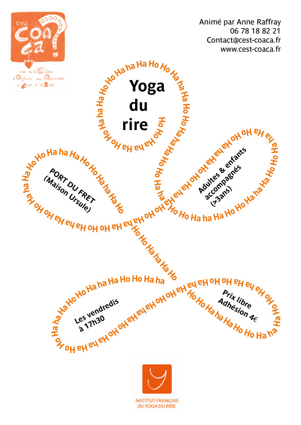

<h2>Modification de l'horaire pour la session de Yoga du Rire du 10 février 2023 : rdv de 18h à 19h à la Maison Ursule au Fret</h2>
**À venir :**
- **Yoga du Rire - tous les vendredis à 17h30 - Maison Ursule - sur le port du Fret**  
*Venir en tenue confortable  et si possible avec un tapis*
- **FNVE #2 : 29 et 30 avril 2023 - Ty Skol CROZON**

*******

### **C'est Coaça ?**, pour un accompagnement des citoyen·nes vers une société libérée de toutes formes de violence. Informer sur les violences éducatives ordinaires, proposer des espaces de partage et d'expérimentation afin de développer des relations sans enjeu de domination et ainsi un apprentissage de la paix.

Pour plus d'informations, contactez-nous par mail : <a href="mailto:contact@cest-coaca.fr">contact@cest-coaca.fr</a>

